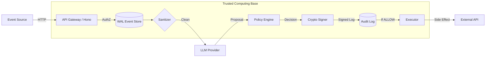

# Auditoria Técnica Completa — ABS (abs-core v2.0.0)

**Idioma**: PT-BR  
**Data**: 2026-02-01  
**Auditor**: Antigravity (Principal Engineer / Security Reviewer)  
**Assunto**: Auditoria de Integridade, Segurança e Operacionalização

---

## 0. Executive Summary

O **abs-core** é um middleware de governança determinística para agentes de IA, desenhado para interceptar intenções de LLMs e bloqueá-las com base em políticas imutáveis antes da execução. Ele resolve o problema de "Excessive Agency" em sistemas autônomos.

**Top 3 Riscos (BLOCKERS):**
*   **Gestão de Identidade (P0)**: As chaves criptográficas de assinatura (Ed25519) são geradas aleatoriamente em memória a cada reinício (`processor.ts`), tornando a "não-repúdio" impossível após qualquer restart.
*   **Escalabilidade (P1)**: O uso de SQLite local com locking em escrita cria um gargalo intransponível para alta concorrência em ambiente single-node.
*   **Inconsistência de Runtime (P0)**: O código mistura dependências exclusivas de Node.js (`better-sqlite3`) com adaptadores para Cloudflare D1 em um único pacote core, quebrando a compatibilidade real com Edge Workers sem build steps complexos.

**Veredito:**
*   **Apto para produção?**: **NÃO**. Falha crítica em persistência de identidade e configuração de escalabilidade.
*   **Buyable hoje?**: **NÃO**. É um protótipo arquitetural ("Architecture Asset"), não um produto. Requer refatoração de infraestrutura (~4-8 semanas) para ser viável.

---

## 1. System Map (Arquitetura Real)

O sistema opera como um pipeline linear de interceptação.

1.  **Event Source** (Webhook/API) -> `POST /events`
2.  **Auth & Trace** (Gateway Hono) -> `requireScope`, `x-trace-id`
3.  **WAL / Event Log** (SQLite/D1) -> Persistência do evento bruto (Imutável)
4.  **Sanitizer** (Regex) -> Inspeção de Payload (Prompt Injection básico)
5.  **LLM Provider** (Adapter) -> `propose()` (Gera intenção estruturada)
6.  **PDP (Policy Decision Point)** -> `policy.evaluate()` (Block/Allow/Escalate)
7.  **Audit Log & Signing** -> Assinatura Ed25519 + HMAC Chain -> `decision_logs`
8.  **Executor / PEP** -> Execução do side-effect (somente se ALLOW)

---

## 2. Trust & Threat Model (TCB e Adversário)

### 2.1 TCB (Trusted Computing Base)
O TCB inclui todo o processo Node.js/Worker. Se o runtime for comprometido, a assinatura é forjada.
*   **Untrusted Input**: Todo payload de evento e toda resposta do LLM.
*   **Weakest Link**: O armazenamento de chaves privadas em memória (`this.asymmetricSigner` em `EventProcessor`).

### 2.2 Adversários e Vetores Mapeados (OWASP LLM Top 10)
*   **Prompt Injection (LLM01)**: Mitigado parcialmente via Regex (`Sanitizer`). Facilmente bypassável com codificação (Base64/Rot13) ou idiomas não-ingleses.
*   **Excessive Agency (LLM08)**: Mitigado pelo Design (Separation of Powers). O LLM propõe, não executa.
*   **Supply Chain (LLM10)**: O `SimplePolicyEngine` está hardcoded no source. Um PR malicioso pode alterar a whitelist silenciosamente.

---

## 3. Enforcement Reality Check

O ABS é **inescapável** apenas se for o **único** caminho para as credenciais de execução.

*   **Host Runtime**: Como o `executor.ts` é apenas uma classe exportada, um desenvolvedor pode importar `WebhookExecutor` diretamente e usar em outro script, bypassando a política.
    *   *Classificação*: **Middleware Útil** (Soft Enforcement).
*   **Correção Necessária**: O `Executor` deve exigir um "Token de Aprovação" assinado criptograficamente pelo `PolicyEngine` para rodar. Sem o token assinado, ele deve lançar erro. Hoje, ele confia no chamador.

---

## 4. Cryptographic Audit (Imutabilidade e Não-Repúdio)

### 4.1 Hash Chain
*   **Estado**: Implementado (`integrity.ts` e `events.ts` usam `previous_hash`).
*   **Problema**: O hash é calculado no banco local. Se o atacante tem acesso ao FS (FileSystem), ele pode reescrever o arquivo SQLite e recalcular os hashes.
*   **Veredito**: Integridade Interna OK, mas frágil contra acesso root.

### 4.2 Non-repudiation (Falha Crítica)
*   **Achado Crítico**: `src/core/processor.ts` linha 71: `this.asymmetricSigner = await AsymmetricSigner.generate(...)`.
*   **Impacto**: A cada restart do processo, uma nova chave par é gerada. Logs antigos assinados com a chave anterior não podem mais ser verificados se a chave pública anterior não foi salva externamente. Como não há registro externo de chaves ("PKI"), a assinatura prova apenas que "alguém com uma chave efêmera assinou isso agora".
*   **Veredito**: **NÃO (Falha de Design)**.

---

## 5. Storage & Scalability

*   **SQLite Locking**: `better-sqlite3` é síncrono. Em um Worker Cloudflare, isso não funciona (Workers não têm FS persistente tradicional). O uso de `D1` é sugerido nos arquivos `infra`, mas o `package.json` força `better-sqlite3`.
*   **Breaking Point**: ~50 requisições/segundo concorrentes causarão `SQLITE_BUSY` ou timeout devido ao lock de escrita exclusivo.
*   **Mitigação**: Filas (`EVENTS_QUEUE`). O processamento deve ser desacoplado da ingestão HTTP.

---

## 6. Testability & Conformance

*   **Cobertura**: Testes unitários existem (`machine.test.ts`), mas faltam testes de integração do fluxo completo de governança.
*   **Conformance**: Não existe suite de testes que verifique "Se eu injetar X, o sistema bloqueia Y".
*   **Ação**: Criar um `compliance-suite` que roda 20 casos de abuso contra a API e verifica se todos são `DENY`.

---

## 7. Observabilidade

*   **Tracing**: Headers `x-trace-id` implementados corretamente.
*   **Logs**: Assinados, mas enviados para `console.log`. Em produção, isso se perde ou mistura. Requer adaptador para Datadog/Sentry.

---

## 8. Security Posture

*   **Secrets**: `.env` usado. Mas chaves críticas são geradas em memória.
*   **AuthZ**: `requireScope` middleware existe. Bom.
*   **Hardening**: Faltam headers de segurança HTTP (Helmet, CORS restritivo) configurados explicitamente no Hono.

---

## 9. Risk Register

| ID | Categoria | Causa-raiz | Impacto | Prob. | Sev. | Evidência | Fix |
|---|---|---|---|---|---|---|---|
| **R01** | **Crypto** | Chaves Ed25519 efêmeras (geradas no boot) | Perda de auditabilidade | 100% | **P0** | `processor.ts:71` | Persistir chaves em Vault/Env |
| **R02** | **Infra** | Dep `better-sqlite3` incompatível com Workers | Falha de Deploy | 100% | **P0** | `package.json` | Separar builds Node vs Worker |
| **R03** | **Enforce** | `Executor` não valida prova de decisão | Bypass de Política | Média | **P1** | `executor.ts` | Exigir `DecisionToken` assinado |
| **R04** | **Scale** | SQLite Write Lock em processos síncronos | Negação de Serviço | Alta | **P1** | `events.ts` | Usar Fila (Queue) obrigatória |
| **R05** | **Security** | Sanitizer via Regex simples | Prompt Injection | Alta | **P2** | `sanitizer.ts` | Adicionar classificador ML |

---

## 10. Roadmap 3–6 meses

### P0 (Imediato - 2 Semanas)
1.  **Crypto Persistence**: Implementar carregamento de chaves Ed25519 via Variável de Ambiente (`ABS_PRIVATE_KEY`).
2.  **Cleaner Build**: Remover `better-sqlite3` das dependências de produção ou isolar em `peerDependencies` opcional. Garantir build limpo para Workers.
3.  **Config Externalization**: Mover regras do `SimplePolicyEngine` para um JSON carregado no boot.

### P1 (Curto Prazo - 4-8 Semanas)
1.  **Queue-First Architecture**: Mover toda lógica de processamento de IA para fora do Loop HTTP, consumindo de uma Fila (SQS/BullMQ/Cloudflare Queues).
2.  **Signed Execution Token**: Refatorar `Executor` para aceitar apenas envelopes assinados.

### P2 (Médio Prazo - 8-12 Semanas)
1.  **Dashboard de Auditoria**: Interface UI para visualizar e verificar assinaturas dos logs.

---

## 11. Buyability Snapshot

*   **O que impede aquisição?**: O sistema é um "Castelo de Cartas" operacional. Funciona no laptop do desenvolvedor, mas quebra no primeiro deploy real (chaves perdidas, build falhando).
*   **Single Maintainer Risk**: Alto. Conhecimento de criptografia + Hono + AI + SQLite concentrado.
*   **Moat**: A estrutura de "Policy as Code" com assinatura blockchain-lite é valiosa, mas a implementação atual é ingênua. O valor está na **Visão**, não no Código atual.

---

## 12. Veredito Final

*   **Technical Score**: 5/10 (Conceitos sólidos, implementação frágil).
*   **Maturidade**: POC Avançada (Alpha).
*   **Buyable today?**: **NÃO**. O custo de refatoração para torná-lo seguro excede o valor do código existente. É um ativo de *Acqui-hire* (contratar o time), não de *Asset Purchase*.

**Ação Imediata (P0)**: Corrigir a geração de chaves criptográficas. Sem isso, o sistema de auditoria é teatro.

---

## Fontes
1.  [OWASP Top 10 for LLM](https://owasp.org/www-project-top-10-for-large-language-model-applications/)
2.  [NIST SP 800-57 (Key Management)](https://csrc.nist.gov/publications/detail/sp/800-57-part-1/rev-5/final)
3.  [Cloudflare D1 Documentation](https://developers.cloudflare.com/d1/)
