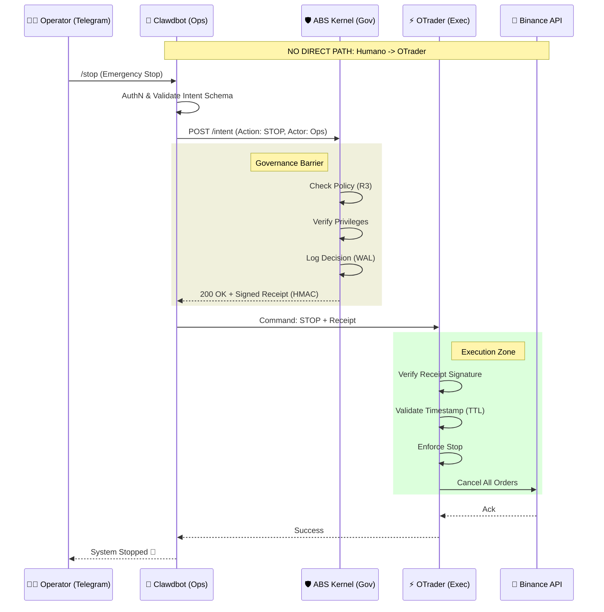

# ABS Integration Contract: Clawdbot (Ops) + ABS (Gov) + OTrader (Exec)
> **Version**: 1.0.0-draft
> **Date**: 2026-01-27
> **Scope**: Governance-as-Code for Automated Trading Operations

## 1. Vision & Architecture

This contract defines the strict separation of concerns required to operate the OTrader automated trading system securely. The core principle is **"Governance First"**: No operational action or financial transaction executes without a cryptographic receipt from the ABS Kernel.

### The Triad

1.  **Clawdbot (The Operator Interface)** 👮
    *   **Role**: Human-Machine Interface (HMI), ChatOps, Intent Capture.
    *   **Responsibility**: Authenticate human operators via Telegram/Terminal. Parse verify intent. Forward intent to ABS.
    *   **Constraint**: NEVER holds exchange API keys. NEVER executes trades directly. NEVER bypasses ABS.
    *   **State**: Ephemeral (Session-based).

2.  **ABS Kernel (The Governor)** ⚖️
    *   **Role**: Policy Enforcement Point (PEP), Risk Engine, Audit Log.
    *   **Responsibility**: Receive intents. Evaluate against `Finance Policy Set v1`. Check global state (Panic Mode, Drawdown). Issue `GOM_RECEIPT` (Signed Governance Object Model Receipt) or `DENY`.
    *   **Constraint**: Cannot execute trades. Cannot originate intents (except automated safety overrides like "Force Close").
    *   **Key Asset**: `ABS_SECRET_KEY` (HMAC Signing Key).

3.  **OTrader (The Executor)** ⚡
    *   **Role**: Algo Trader, Strategy Engine, Order Router.
    *   **Responsibility**: Execute trading strategies. Listen for Ops Commands. **Verify ABS Receipts** before any side-effect. Manage Binance Connection.
    *   **Constraint**: Must fail-closed if ABS is unreachable or receipt is invalid. Holds `BINANCE_API_KEY` in memory (vault).

### Architecture Diagram

## 2. Authorized Commands (Ops-Only)

Clawdbot is restricted to **Operational Intents** only. It CANNOT request specific trade entries (e.g., "Buy BTC").

### Whitelist (`ClawdbotOpsProfile`)

| Command | Intent ID | Scope | Policy Level | Description |
| :--- | :--- | :--- | :--- | :--- |
| `/status` | `OPS_STATUS` | `read` | R0 | Get system health, PnL, risk exposure. |
| `/pause` | `OPS_PAUSE` | `control` | R1 | Pause new entries. Manage existing. |
| `/resume` | `OPS_RESUME` | `control` | R2 | Resume strategy execution (requires 2FA/Confirmation). |
| `/panic` | `OPS_PANIC` | `critical` | R3 | **KILL SWITCH**. Close all positions, cancel orders, exit. |
| `/config` | `OPS_CONFIG` | `admin` | R3 | Update internal parameters (e.g., trailing stop). No code changes. |
| `/report` | `OPS_REPORT` | `read` | R0 | Generate performance report. |

**Explicitly Prohibited for Clawdbot:**
*   `TRADE_ENTRY` (Manual buy/sell)
*   `KEY_UPDATE` (Changing API keys via chat)
*   `WITHDRAW` (Fund movement)

## 3. Authentication & Non-Repudiation

1.  **Human -> Clawdbot**:
    *   Telegram User ID Whitelist (Hardcoded in Clawdbot Config).
    *   Context-aware MFA (e.g., for R3 commands, bot sends a code to a secondary channel or requires a specific phrase confirmation).

2.  **Clawdbot -> ABS**:
    *   mTLS or Service Token (`ABS_CLIENT_ID` + `ABS_CLIENT_SECRET`).
    *   Intent signed with `Clawdbot Private Key` (optional, for full audit trail).

3.  **ABS -> OTrader**:
    *   **Receipt-based**: OTrader trusts the *Receipt*, not the sender.
    *   Receipt contains: `Action`, `Params`, `Timestamp`, `Nonce`, `Signature`.

## 4. Failure Modes

*   **Clawdbot Down**: OTrader continues autonomously (Governance remains in ABS).
*   **ABS Down**: OTrader **PAUSES** (Fail-Closed). No new trades. Risk reduction only (Closing enabled if pre-approved).
*   **OTrader Down**: ABS flags "Executor Unhealthy". Clawdbot alerts Operator.
