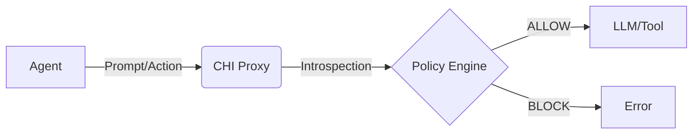

# Cognitive Host Interface (CHI)

The **Cognitive Host Interface (CHI)** is an open standard (ADR-004) for exposing an AI agent's internal state, intent, and memory to the host system. It transforms the agent from a "Black Box" into an "Open Box" for governance.

## Core Pillars

### 1. Introspection

The agent must be able to answer: _"What are you doing?"_ and _"Why are you doing it?"_.
CHI formalizes this via the `CHIAnalysis` schema:

```typescript
interface CHIAnalysis {
  intent: string; // "Refactoring user login flow"
  risk_assessment: {
    level: "low" | "medium" | "high";
    factors: string[]; // ["Modifies auth code", "Deletes files"]
  };
  next_action: string; // "edit_file /src/auth.ts"
}
```

### 2. Output Guardrails (Vaccines)

CHI injects "vaccines" into the agent's output stream to intercept unsafe patterns _before_ they are executed.

- **System Prompt Leakage**: Detects if the agent reveals its core instructions.
- **PII Leakage**: Redacts emails, keys, and phone numbers.
- **Hallucination Check**: Validates that cited files actually exist (optional).

### 3. Memory & Drift

CHI monitors the agent's "Drift" — deviation from the original user goal.

- **Goal**: "Fix the CSS bug."
- **Action**: "Deleting the database."
- **Drift**: **HIGH**. CHI blocks this action because it creates a semantic violation of the session goal.

## Implementation

CHI is implemented via the **ABS Kernel** and enforced by the **Proxy**.


